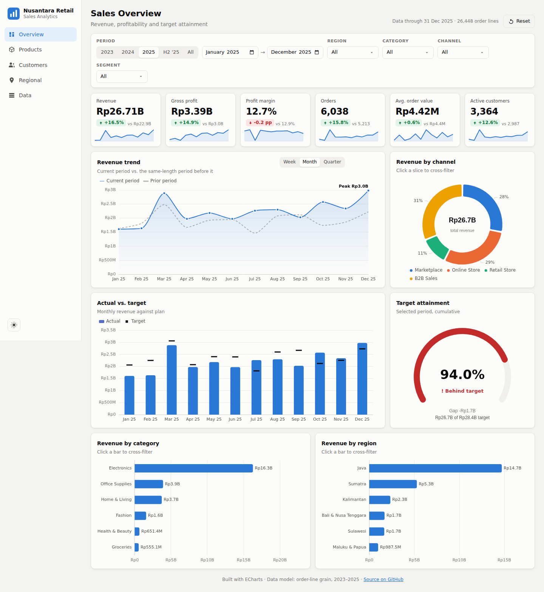
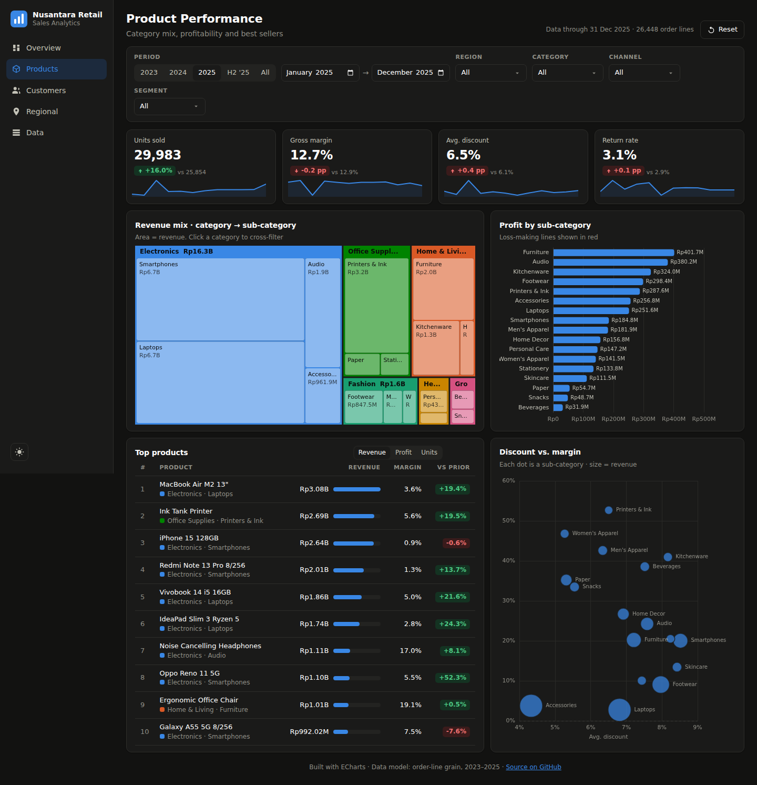
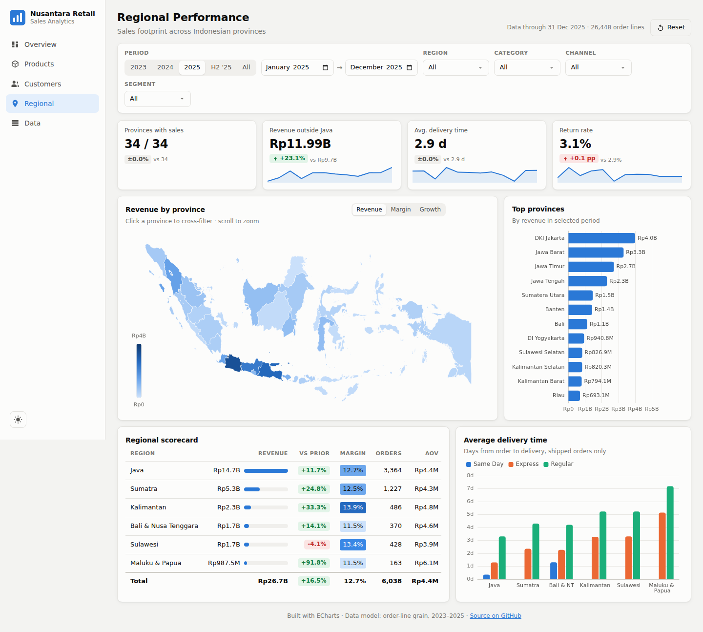

# Nusantara Retail Sales Dashboard

This interactive dashboard presents the sales performance of Nusantara Retail, a retail company that sells products throughout Indonesia. The company sells through four channels: its own online store, online marketplaces, physical stores, and a business-to-business (B2B) sales team.

The dashboard follows the style of business intelligence tools such as Power BI and Looker Studio. Users can filter the data, click on charts to explore specific segments, and compare results with earlier periods.

**Live demo:** https://haikalfr04.github.io/Sales-Dashboard/



---

## Objectives

The dashboard is designed to answer the following business questions:

1. How are sales and profit developing over time, and how do they compare with the previous period?
2. Is the company meeting its monthly sales targets?
3. Which products, categories, and sales channels contribute the most revenue, and which ones generate losses?
4. How many new customers does the company acquire, and how many of them return to purchase again?
5. Which regions and provinces of Indonesia generate the most sales, and where is growth the fastest?

## Dashboard Pages

| Page | Content |
|---|---|
| **Overview** | Key performance figures, the monthly sales trend, sales compared with targets, and sales by channel, category, and region. |
| **Products** | The share of sales by category and sub-category, profit by sub-category, the ten best-selling products, and the relationship between discounts and profit margin. |
| **Customers** | New and returning customers per month, customer retention over time, sales by customer segment, and preferred payment methods. |
| **Regional** | A map of sales by province, the top provinces, a summary table for each region, and average delivery times. |
| **Data** | A searchable and sortable table of all transactions that match the selected filters. The table can be downloaded as a CSV file. |

| | |
|---|---|
|  |  |

## Main Features

- **Filters:** Users can select a time period (2023, 2024, 2025, the second half of 2025, or all years) or set a custom range of months. Users can also filter by region, product category, sales channel, and customer segment.
- **Interactive charts:** Clicking a bar, a slice, a map area, or a table row filters the entire dashboard to that item. Holding Ctrl (or Cmd on Mac) while clicking selects several items at once.
- **Active filter list:** All applied filters are shown above the charts, and each one can be removed with a single click.
- **Comparison with the previous period:** Each key figure shows the change compared with the previous period of the same length, together with a small trend line.
- **Sales targets:** Monthly sales are compared with the target for each region, and a gauge shows the percentage of the target achieved.
- **Chart options:** Every chart can be displayed as a table, enlarged to full screen, or downloaded as a CSV file.
- **Shareable links:** The selected page and filters are saved in the page address, so a specific view can be shared with other people.
- **Light and dark mode:** The dashboard adapts to desktop, tablet, and mobile screens.

## Data

The dashboard uses two data files, located in the `data` folder.

**`sales.csv`** contains about 26,000 rows of sales transactions from January 2023 to December 2025. Each row represents one product within an order.

| Column | Description |
|---|---|
| `order_id`, `order_date` | Order number and order date |
| `customer_id`, `segment` | Customer number and customer type (Consumer, SME, or Corporate) |
| `channel` | Sales channel (Marketplace, Online Store, Retail Store, or B2B Sales) |
| `payment_method` | Payment method used by the customer |
| `ship_mode`, `delivery_days` | Shipping method and number of days needed for delivery |
| `region`, `province`, `city` | Customer location (6 regions and 34 provinces) |
| `product_id`, `category`, `sub_category`, `product_name` | Product information |
| `quantity`, `unit_price`, `discount` | Number of units, price per unit, and discount given |
| `sales`, `cost`, `profit` | Sales value, cost, and profit in Indonesian Rupiah |
| `returned` | Indicates whether the order was returned (1 = yes, 0 = no) |

**`targets.csv`** contains the monthly sales target for each region.

The data is produced by the script `scripts/build_dataset.py`. The script reflects common patterns in Indonesian retail, including:

- annual business growth, with faster growth outside Java
- a gradual shift from physical stores to online channels
- higher sales during Ramadan and lower sales after Eid al-Fitr
- sales peaks during online shopping events such as 11.11 and 12.12
- higher spending around payday
- large orders from business customers
- marketplace fees and product returns

To recreate the data, run:

```bash
python scripts/build_dataset.py
```

## Calculation Definitions

| Measure | Definition |
|---|---|
| Revenue | Total sales value |
| Gross profit | Total sales minus total cost |
| Profit margin | Gross profit divided by revenue |
| Orders | Number of unique orders |
| Average order value | Revenue divided by the number of orders |
| Average discount | Percentage reduction from the original price |
| Return rate | Percentage of orders that were returned |
| New customers | Customers whose first purchase falls within the selected period |
| Repeat-purchase rate | Percentage of customers who placed two or more orders in the selected period |
| Target achievement | Revenue divided by the sales target |
| Previous period | The same number of months immediately before the selected period |

## Tools Used

- **HTML, CSS, and JavaScript** for the dashboard. No additional framework or build step is required.
- **[Apache ECharts](https://echarts.apache.org/)** for the charts and the map.
- **[Papa Parse](https://www.papaparse.com/)** for reading the CSV files.
- **Python** (standard library only) for preparing the data.
- **Province map data** from public BAKOSURTANAL and Dukcapil boundary data, obtained through [ans-4175/peta-indonesia-geojson](https://github.com/ans-4175/peta-indonesia-geojson) and simplified for faster loading.

## Project Structure

```
├── index.html                  Page layout
├── assets/
│   ├── css/style.css           Visual styling, including light and dark mode
│   ├── js/app.js               Filters, charts, and interactions
│   ├── js/util.js              Number formatting and calculation helpers
│   ├── geo/                    Indonesia province map
│   └── vendor/                 ECharts and Papa Parse libraries
├── data/                       sales.csv and targets.csv
├── scripts/build_dataset.py    Data preparation script
├── docs/                       Screenshots
└── .github/workflows/pages.yml Automatic publishing to GitHub Pages
```

## Running the Dashboard Locally

The dashboard reads its data from files, so it must be opened through a local web server rather than directly from the folder.

1. Open a terminal in the project folder.
2. Run the following command:
   ```bash
   python -m http.server 8000
   ```
3. Open `http://localhost:8000` in a web browser.

## Publishing

The dashboard is published automatically to GitHub Pages each time changes are pushed to the `main` branch. To enable publishing in a new copy of this repository, open **Settings → Pages** and set **Source** to **GitHub Actions**.
